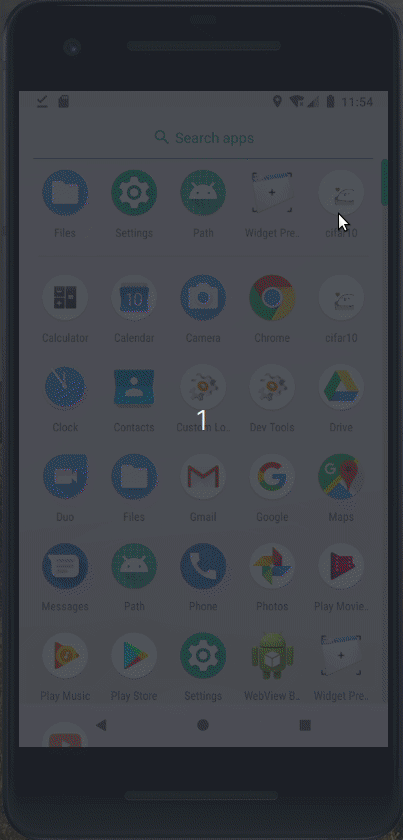
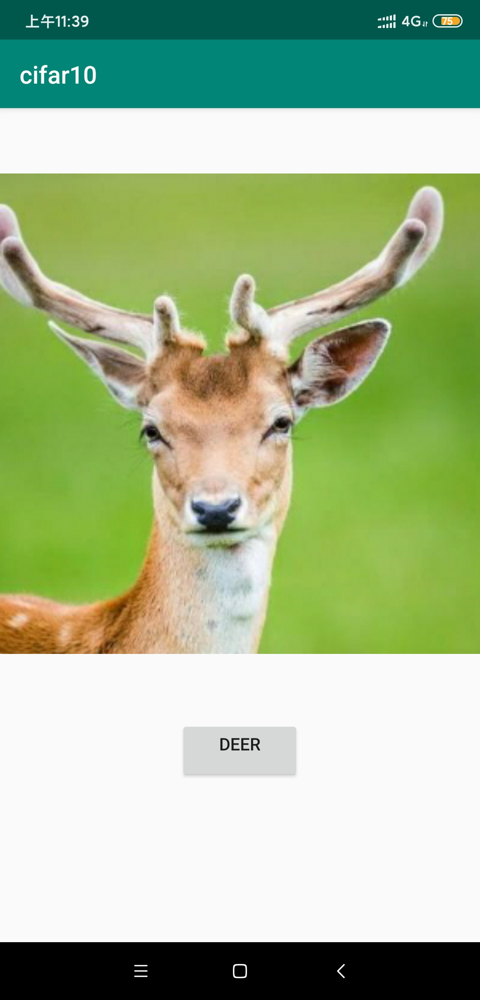

### Pytorch Cifar10 部署到 Android 7+ 
#### demo




模拟器中实测有误，各种误判ship



#### 环境说明

```
Android 7+ 
pytorch 1.3.0 个人建议1.3.0, 1.3.1的torch保存的手机文件model.pt，Android Studio中加载模型会出错
```

#### 踩坑

```
相机权限：安卓6之后的动态权限，安卓7之后调相机的权限
pytorch版本1.3.1编译后的model.pt跑不同，解压后发现其code文件夹的大小与官方demo给的model.pt的大小不一致
```

#### 代码文件说明

```
若现有工程源码打开无法直接运行，以下是非IDE生成的代码文件
1. Cifar10源码： ./ResNet18_Cifar10/resnet18_cifar10.py 
2. 下载NDK
3. app/build.gradle 注意是app模块下的构造文件，这里会下载些东西
4. 其他 app/src/main 下 asserts java res AndroidManifest.xml都有改动
```

